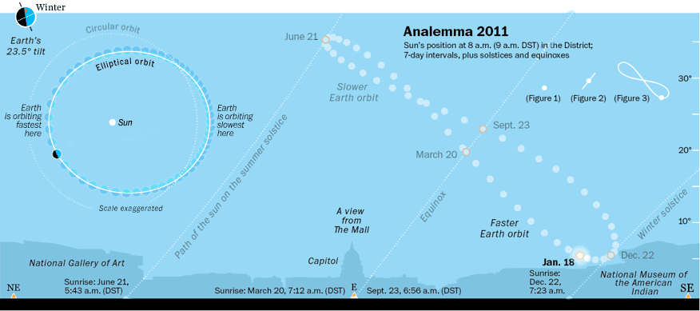

## Atividade 2 - Posição do Sol no céu

O objetivo dessa atividade está em desenhar o caminho do Sol em um diagrama que simula a visão do céu acima de um determinado ponto. O movimento aparente do Sol marcado, ao longo do ano, sempre num mesmo horário do dia, recebe o nome de analema.

*Figura 2.1 - Analema sobre Washington DC. Fonte: [The Washington Post](https://www.washingtonpost.com/wp-srv/special/metro/urban-jungle/pages/110118.html)*

Existe um analema para cada horário do dia, onde cada ponto corresponde a um dia do ano, e uma sequência de pontos de diferentes horários para um mesmo dia formam uma linha do caminho do Sol para essa data. Toda essa informação pode ser exibida em um gráfico de coordenadas polares (ângulos zenital e azimutal), como se fosse uma imagem de céu inteiro.

A **bibloteca pvlib** contém várias funções voltadas para simular energia solar em sistemas fotovoltaicos. Assim, é muito útil para estudos em radiação atmosférica, por já ter vários cálculos implementados e dados tabelados disponíveis para consulta.

1. Faça o fork do repl [radiacao2](https://replit.com/@viniroger/radiacao2), rode o script da atividade e analise a figura gerada;
2. Cada aluno deve escolher um local para gerar o gráfico do caminho do Sol no dia (altere o fuso horário e comente a diferença);
3. Compare o seu resultados com os dos colegas e explique as semelhanças e diferenças;
4. Simplifique o script para desenhar somente o caminho do Sol para um determinado dia (sem analemas horários).

Extra: um simulador interativo do movimento aparente do Sol no céu pode ser visto nesse link da Universidade de Nebraska: [Motions of the Sun Simulator](http://astro.unl.edu/naap/motion3/animations/sunmotions.html).