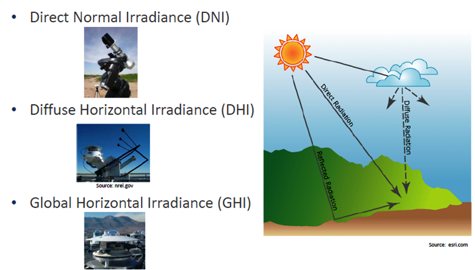

## Atividade 3 - Irradiância de céu claro

Essa atividade tem como objetivo fazer um gráfico do ciclo diário da irradiância considerando o céu claro (sem nuvens). Esse tipo de informação é particularmente útil para estimar a irradiância esperada em um ponto, tendo aplicações desde a obteção de produtos de satélite até uma projeção de energia solar máxima esperada.

* Irradiância Normal Direta (DNI): quantidade de radiação solar recebida por unidade de área por uma superfície que é sempre mantida perpendicular (ou normal) aos raios que vêm em linha reta da direção do sol em sua posição atual no céu. Normalmente, pode-se maximizar a quantidade de irradiância recebida anualmente por uma superfície mantendo-a normal à radiação recebida. Esta quantidade é de particular interesse para instalações solares térmicas concentradas e instalações que rastreiam a posição do sol.
* Irradiância Horizontal Difusa (DHI): quantidade de radiação recebida por unidade de área por uma superfície (não sujeita a nenhuma sombra ou sombra) que não chega em um caminho direto do sol, mas foi espalhada por moléculas e partículas na atmosfera e vem igualmente de todas as direções.
* Irradiância Horizontal Global (GHI): quantidade total de radiação de ondas curtas recebida de cima por uma superfície horizontal ao solo. Este valor é de particular interesse para instalações fotovoltaicas e inclui Irradiância Normal Direta (DNI) e Irradiância Horizontal Difusa (DHI).

*Figura 3.1 - Ilustração dos tipos de irradiância*

A energia solar que incide sobre o topo da atmosfera (TOA) interage com uma camada de ar até atingir a superfície terrestre. A fração do fluxo incidente sobre um sistema que consegue atravessá-lo é chamada de transmitância. Assim, a irradiância que atinge a superfície após interagir com a atmosfera, desconsiderando-se as nuvens, é chamada de irradiância de céu claro (ou CSI, do inglês *Clear Sky Irradiance*).

Existem vários modelos de transferência radiativa que permitem calcular o efeito da atmosfera na propagação da energia solar. Alguns deles são mais simplificados, enquanto outros consideram fenômenos que devem ser considerados ou que podem ser negligenciados, conforme a escala de trabalho. Nessa atividade, é considerado o modelo de Ineichen & Perez (2002), por sua vez baseado no coeficiente Linke turbidity (Linke, 1922) - conceito a ser trabalhado em outra atividade.

1. Faça o fork do repl [radiacao3](https://replit.com/@viniroger/radiacao3), rode o script da atividade e analise a figura gerada;
2. Usando o mesmo local e data da atividade anterior, refaça o gráfico;
3. Compare seu gráfico com os dos colegas e sintetize as conclusões.

Extra: o script annual_cycle.py gera a radiação que chega no topo da atmosfera com frequência mensal. Rode o script para o seu local de estudo, analise o gráfico e compare o resultado com os colegas.