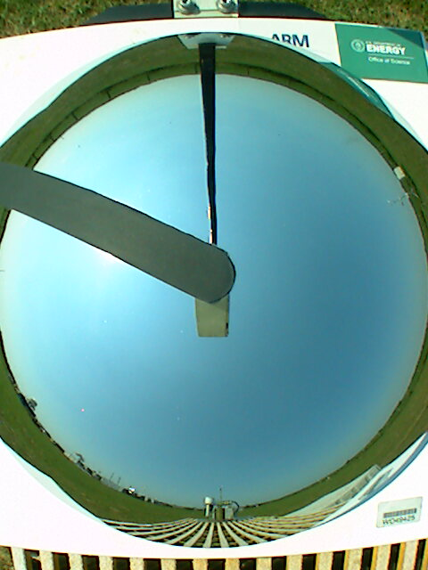
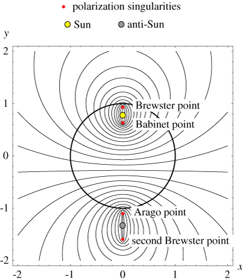

## Atividade 4 - Polarização do céu

O objetivo dessa atividade está em representar os padrões de polarização do céu conforme a posição do Sol. A atmosfera terrestre, fortemente iluminada pela luz branca do Sol, espalha preferencialmente luz com frequências próximas à da cor azul, em todas as direções. O espalhamento Rayleigh acontece quando as partículas que interagem com a luz têm um tamanho muito menor do que o comprimento de onda da luz - caso das moléculas de oxigênio e nitrogênio.

Assim, mais radiação azul é removida do feixe solar direto, aumentando o componente difuso. Quanto mais próximo do horizonte estiver o Sol, maior a remoção desse feixe, resultando na coloração avermelhada. No céu, o Sol apresenta aparência brilhante e esbranquiçada enquanto que o restante apresenta um padrão de polarização.

O modelo Rayleigh do céu descreve o padrão de polarização observado do céu diurno. De modo geral, o céu é polarizado tangencialmente a um círculo centrado no Sol e a polarização máxima é encontrada em 90° dele, sendo não-polarizada na direção do Sol e do anti-Sol. As linhas de polarização e pontos de singularidade podem ser vistas na figura a seguir:

*Figura 4.1 - Linhas de polarização no céu, com a elevação do Sol de 15° - o círculo central corresponde ao céu visível nessas condições. [Fonte: Berry et al 2004](https://doi.org/10.1088/1367-2630/6/1/162)*

A polarização é caracterizada em cada comprimento de onda por seu grau de polarização e orientação (ângulo de dispersão). O pesquisador chefe do Observatório Nacional TÜBİTAK (Turquia), Oğuzhan Okuyan, publicou um [código](https://github.com/ookuyan/py_sky) (ainda experimental) com o modelo que descreve o padrão de polarização no céu.

1. Faça o fork do repl [radiacao4](https://replit.com/@viniroger/radiacao4), rode o script da atividade e descreva a animação gerada;
2. Altere parâmetros do código para que seja gerado uma animação com o movimento do Sol ao longo de um dia;
3. É possível aumentar a resolução das imagens? Faça testes e discuta com os colegas.
4. Quais parâmetros devem ser alterados para considerar diferentes localizações e datas? Como fazer um script para considerar isso?

Outras atividades interessantes para espalhamentos Rayleigh e Mie: https://miepython.readthedocs.io/en/latest/04_rayleigh.html ; https://phet.colorado.edu/pt_BR/simulations/molecules-and-light