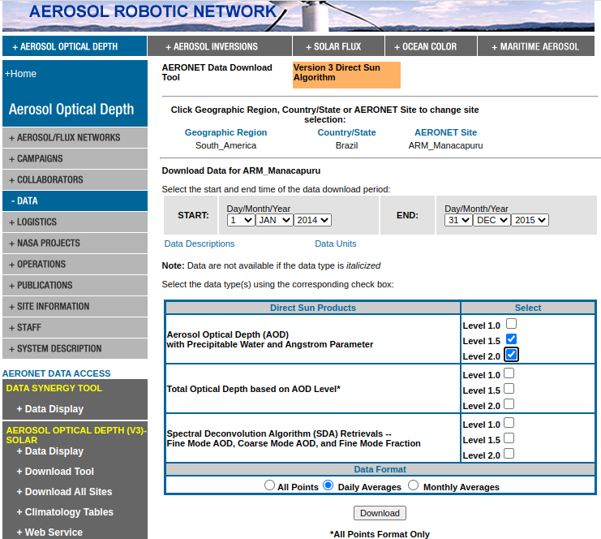

## Atividade 6 - AERONET

Essa atividade tem como objetivo a comparação de valores de profundidade óptica do aerossol (AOD) ao longo de diferentes períodos de tempo e diferentes locais através da disposição de dados da AERONET em gráficos de séries temporais.

O programa AERONET (AErosol RObotic NETwork) é uma federação de redes terrestres de sensoriamento remoto de aerossóis estabelecidas pela NASA e PHOTONS, sendo amplamente expandido por outras redes e colaboradores. Por mais de 25 anos, o projeto forneceu um banco de dados de domínio público de longo prazo, contínuo e prontamente acessível de propriedades óticas, microfísicas e radiativas de aerossóis para pesquisa e caracterização de aerossóis, validação de recuperações de satélites e sinergismo com outros bancos de dados. A rede impõe padronização de instrumentos, calibração, processamento e distribuição.

Existe uma ferramenta online para solicitação de dados da AERONET que pode ser acessada pelo seguinte link: [Download Tool](https://aeronet.gsfc.nasa.gov/cgi-bin/webtool_aod_v3). Escolha o sítio e, na tela seguinte, o período e o produto (Aerosol Optical Depth (AOD) with Precipitable Water and Angstrom Parameter, Level 1.5 ).

Obs: level 1.0 (raw data), level 1.5 (automated cloud­screened data), and level 2.0 (quality­assured data). Level 2.0 data is only available several months after the measurements

1. Faça o fork do repl [radiacao6](https://replit.com/@viniroger/radiacao6), rode o script da atividade e descreva a imagem gerada;
2. Escolha uma estação próxima ao seu local de estudos (da tabela disponível no documento principal), período e formato ("All points" para estudar ciclo diurno, "daily averages" para estudo sazonal, "monthly averages" para verificação de tendência) da tabela a seguir e baixe os dados em um arquivo;
3. Insira as informações em seu script, execute-o para gerar o gráfico e faça sua análise;
5. Gere gráficos também das variáveis "Precipitable_Water(cm)" e "440-675_Angstrom_Exponent", discutindo os resultados obtidos;
6. Compare seus gráficos com os dos colegas.
