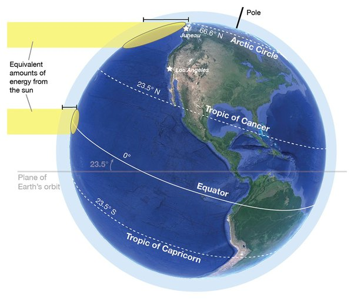
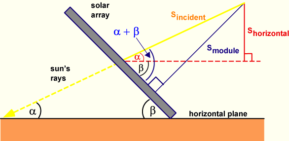

## Atividade 8 - Radiação solar em superfície inclinada

O objetivo dessa atividade é mostrar o cálculo de radiação solar em uma superfície inclinada para determinar o melhor ângulo de inclinação de um painel solar. Também será verificado o efeito da inclinação em diferentes latitudes e épocas do ano.

*Equivalentes quantidades de energia vindo do sol em inclinações diferentes. Fonte: [Vision Learning](https://www.visionlearning.com/en/library/Earth-Science/6/Factors-that-Control-Regional-Climate/255)*

A potência incidente em um módulo fotovoltaico depende não apenas da potência contida na luz vinda do sol, mas também do ângulo entre o módulo e o sol. Pela figura, pode-se deduzir que módulo fotovoltaico deve ser orientado para o equador, de modo que fica voltado para o norte no Hemisfério Sul e para o sul no Hemisfério Norte.

Além disso, quando a superfície absorvedora e a luz do sol são perpendiculares entre si, a densidade de potência na superfície será máxima. No entanto, como o ângulo entre o sol e uma superfície fixa muda continuamente, a densidade de potência em um módulo fotovoltaico fixo geralmente é menor que a da luz solar incidente.

Um sistema de rastreamento permite que a superfície frontal do painel solar fique sempre de frente para os raios solares. Já em um sistema fixo, deve-se escolher o melhor ângulo de inclinação já em sua instalação.

A figura a seguir mostra como calcular a radiação incidente em uma superfície inclinada (Smodule) dada a radiação solar medida na superfície horizontal (Shoriz) ou a radiação solar medida perpendicularmente ao sol (Sincident), conforme a figura.

*Ângulos envolvendo um feixe de radiação solar incidente em um painel inclinado. Fonte: PV Education*

A relações entre os fluxos é dada por:

$$S_{horizontal}=S_{incident} \sin \alpha$$
$$S_{module}=S_{incident} \sin (\alpha+\beta)$$

onde α é o ângulo de elevação do sol e β é o ângulo de inclinação do módulo medido a partir da horizontal. O ângulo de elevação é dado por:

$$\alpha=90-\phi+\delta$$

onde $\phi$ é a latitude e $\delta$ é o ângulo de declinação, dado por:

$$\delta=23.45^{\circ} \sin \left[\frac{360}{365}(284+d)\right]$$

onde d é o dia do ano. A partir dessas equações, uma relação entre Smodule e Shoriz pode ser determinada como:

$$S_{module}=\frac{S_{Shorizontal} \sin (\alpha+\beta)}{\sin \alpha}$$

A simulação do link a seguir calcula o valor máximo de insolação solar em função da latitude e do ângulo do módulo: https://www.pveducation.org/pvcdrom/properties-of-sunlight/solar-radiation-on-a-tilted-surface . Nele, cada curva representa as seguintes variáveis:

- Potência do módulo - radiação solar que atinge um módulo inclinado (o ângulo de inclinação do módulo é medido a partir da horizontal);

- Potência Incidente - radiação solar que seria recebida por um módulo que acompanha perfeitamente o sol (perpendicular);

- Potência na Horizontal - radiação solar que atinge o solo e é o que seria recebido por um módulo deitado no chão.

1. Nas barras de latitude e inclinação do módulo ("tilt"), insira a latitude de seu local de estudo e uma inclinação de 0°. Por que as linhas de potência horizontal e do módulo coincidem, mas diferem da potência incidente?

2. Compare as curvas obtidas com os colegas, apontando e explicando as diferenças.

3. Altere os valores de inclinação do painel e verifique o comportamento da curva de potência do módulo. Qual seria o melhor ângulo para o meio do ano e para o início/final do ano? Salve o gráfico (botão direito, "salvar imagem como") e "suba" o arquivo para o seu replit.

4. Existe um ângulo ótimo para o ano todo? Caso exista, compare esse valor com os obtidos pelos colegas. Salve o gráfico e "suba" o arquivo para o seu replit.

Obs.: Existem fatores climáticos, e não somente geométricos, que afetam a escolha correta do ângulo de inclinação nos sistemas fotovoltaicos.

Extras: [Como determinar o ângulo de inclinação dos módulos fotovoltaicos?](https://canalsolar.com.br/como-determinar-o-angulo-de-inclinacao-dos-modulos-fotovoltaicos/) e [documentação de métodos da pvlib para cálculo de radiação em plano inclinado](https://pvlib-python.readthedocs.io/en/stable/_modules/pvlib/irradiance.html)

