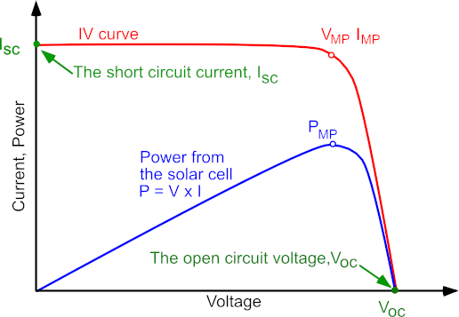
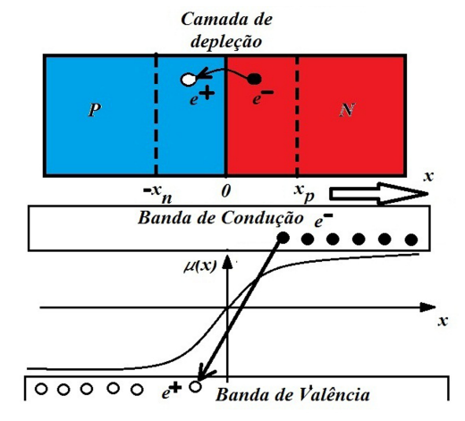
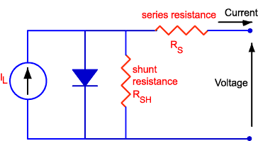

## Atividade 9 - Simulação de sistema PV

O objetivo dessa atividade é entender alguns aspectos de caracterização de um sistema fotovoltaico e a influência de temperatura e irradiância na geração de energia. Também será utilizado um Aplicativo de Dimensionamento Solar Fotovoltaico para estimar a energia (em MW) em diferentes locais e épocas do ano.

Painéis solares são formados de um ou mais módulos fotovoltaicos interligados eletricamente. O sistema é composto também de inversor (transforma a corrente contínua dos painéis em alternada) e, por vezes, seguidores solares (movimentam os painéis em um ou dois eixos para seguir o movimento do Sol e aumentar a eficiência). Para ver outros tipos de usinas solares e entender melhor o funcionamento de um painel fotovoltaico, veja o post: [Usinas Solares](https://www.monolitonimbus.com.br/usinas-solares/).

Uma das formas de se caracterizar uma célula solar, asism como acompanhar sua degradação com o tempo, é através de sua **curva IV**. Essa curva é a superposição da curva IV (corrente *versus* tensão) do diodo da célula solar no escuro com a corrente gerada pela luz. Acompanhe a explicação no diagrama desse link da [PV Education](https://www.pveducation.org/pvcdrom/solar-cell-operation/iv-curve).

*Curva IV e a respectiva curva de potência. Fonte: PV Education*

A curva IV e de potência apresentam alguns pontos importantes:

- P_MP(I_MP,V_MP) - potência máxima da célula solar;
- I_SC - corrente de curto-circuito, é a corrente máxima de uma célula solar e ocorre quando a tensão é zero;
- V_OC - tensão de circuito aberto, é tensão máxima disponível a partir de uma célula solar e ocorre com corrente zero.

Por fim, o fator de preenchimento (FF) é definido como a razão da P_MP para o produto de I_SC e V_OC. Graficamente, o FF é a área do maior retângulo que caberá na curva IV. Para comparação de células, considera-se temperatura e irradiância padrão em 25°C e 1000 W/m².

### Efeitos da temperatura

A temperatura de um módulo fotovoltaico depende de alguns fatores climáticos, como radiação solar incidente, temperatura ambiente, velocidade e direção do vento, propriedades físicas dos materiais das células e estrutura de montagem. E como a temperatura influencia na geração de energia?

O material responsável pela geração de energia elétrica a partir da radiação solar é um semicondutor (apresenta condutividade elétrica entre a de um metal e a de um isolante). Os elétrons em um semicondutor devem obter energia (por exemplo, a partir de radiação ionizante) para atravessar o intervalo de energia entre a banda de valência (faixa mais alta de energias eletrônicas) e a banda de condução (faixa mais baixa de estados eletrônicos vazios).

*Junçãao p-n e perfil do potencial
químico µ(x) ao longo do dispositivo (Fonte: [Lima et al., 2019](http://dx.doi.org/10.1590/1806-9126-RBEF-2019-0191)) - mais detalhes no vídeo: https://youtu.be/TCQhdAHOSIk?t=132*

Geralmente o tipo de material que forma a célula fotovoltaica possui átomos realizando quatro ligações com seus vizinhos, mantendo assim os seus elétrons "presos". Porém, uma das camadas é tratada com fósforo e é deixada com elétrons extras; a outra, com boro, passa a ter uma carência de elétrons, deixando "buracos" vazios. Assim, temos duas metades: a primeira com uma carga negativa e a segunda, positiva, que juntas formam a junção PN. Quando um fóton proveniente da luz solar atinge esse sistema, ele pode excitar um elétron suficiente para que ele saia de sua posição original e passe a se mover livremente. O mesmo é válido para o buraco deixado na sua ausência. Esse fenômeno se chama efeito fotoelétrico e por causa da polarização, os elétrons viajam somente em direção (ao lado negativo) e os buracos para o outro lado (positivo). Dessa forma, essas partículas negativas seguem caminho para um fio que eventualmente retorna aos início, fechando o ciclo (corrente elétrica).

Quando acontece um aumento de temperatura, ocorre uma diminuição desse intervalo, além de um aumento da energia dos elétrons. Assim, é necessária uma energia menor para quebrar a ligação eletrônica. Esse *aumento de temperatura que leva à diminuição da tensão e diminuição no ponto de máxima potência*.

### Efeitos da intensidade de radiação solar

A variação da intensidade de luz incidente em uma célula solar altera todos os seus parâmetros, incluindo a corrente de curto-circuito, a tensão de circuito aberto, o FF, a [eficiência](https://www.pveducation.org/pvcdrom/solar-cell-operation/solar-cell-efficiency) (fração da energia incidente que é convertida em eletricidade) e a resistência.

A resistência característica de uma célula solar é a resistência de saída da célula em seu ponto de potência máxima (R = V_MP/I_MP). Tanto a magnitude quanto o impacto da resistência dependem da geometria (área) da célula solar, no ponto de operação da célula solar. A resistência característica é útil porque coloca a resistência em série e em derivação no contexto.

*Esquema de circuito de célula solar com resistências parasitas em série e em derivação. Fonte: PV Education*

A resistência em série em uma célula solar tem três causas: (1) o movimento da corrente através do emissor e da base da célula solar; (2) a resistência entre o contato do metal e do silício; (3) a resistência dos contatos metálicos superiores e traseiros. O principal impacto da resistência em série é reduzir o fator de preenchimento (e a potência máxima, vide [diagrama](https://www.pveducation.org/pvcdrom/solar-cell-operation/fill-factor)), embora valores excessivamente altos também possam reduzir a corrente de curto-circuito.

A resistência de derivação geralmente é atribuída a defeitos de fabricação, onde caminhos alternativos para a passagem da corrente elétrica geram perda de potência gerada.

A resistência em série tem um efeito maior no desempenho em alta intensidade (incluindo concentradores) e a resistência em derivação tem um efeito maior no desempenho da célula em baixa intensidade de luz (aurora, ocaso e céu nublado).

1. Faça o fork do projeto e rode o script para gerar a [figura](https://pvlib-python.readthedocs.io/en/stable/gallery/iv-modeling/plot_singlediode.html#sphx-glr-gallery-iv-modeling-plot-singlediode-py).
2. O que acontece com a corrente de curto-circuito e com a tensão de circuito aberto conforme a temperatura aumenta (com a irradiância cosntante)? E o que acontece com a potência máxima da célula solar?
3. Faça a mesma análise da questão anterior, mas mantendo a temperatura constante e variando somente a irradiância.

## Dimensionamento fotovoltaico

O dimensionamento fotovoltaico é uma análise do local em que vai ser implementado um sistema para produção de energia solar. Ele ajuda a entender a demanda necessária, com o melhor aproveitamento do espaço disponível, para implantação de painéis solares.

Com esse intuito, pesquisadores do Departamento de Engenharia Elétrica e de Computação (SEL) da Escola de Engenharia de São Carlos (EESC) da USP deselvolveram um [aplicativo](https://jornal.usp.br/universidade/aplicativo-gratuito-desenvolvido-na-usp-ajuda-na-implantacao-de-paineis-de-energia-solar/). Ele utiliza uma base de dados brasileira, desenvolvida pelo LABREN/INPE, portanto somente cidades brasileiras podem ser usadas.

1. Instale o aplicativo [Curso Solar USP](https://play.google.com/store/apps/details?id=br.usp.eesc.pv_sizing_app&pli=1) no Android;
2. Escolha a cidade e anote a irradiação média anual e o mês com o maior valor;
3. Escolha o módulo fotovoltaico (JAM78S10-400/MR ou JAM78S10-450/MR, caso use a mesma cidade) e o inversor (5.0kWpMIN 5000TL-X Growatt) - a saída do módulo fotovoltaico deve ser compatível com a entrada do inversor, ou seja, P_MP, I_SC e V_OC devem ser menores ou iguais aos valores de entrada do inversor;
4. Preencha os dados do sistema: temperatua mínima (5°C), eficiência (0.8), fator de simultaneidade (0.37), fator de emissão de CO2 (0.086);
5. Preencha os dados da unidade consumidora: tipo de conexão (bifásico três fios) e média mensal (641.25);
6. Preencha as taxas e consumo: ICMS (0.25), CIP (10), tarifa de energia (0.66);
7. Quais foram os dados resultantes da instalação fotovoltaica? Compare com os valores obtidos pelos colegas em diferentes condições;
8. Com relação ao inversor, qual a geração fotovoltaica mensal média estimada? Compare o valor e o formato do gráfico de valores mensais com os colegas, assim como o valor da economia gerada.