# Atividade 11 - Modelo de transferência radiativa e comentários da avaliação

-> Apresentação sobre o modelo BRASIL-SR

-> Pontos para comentar da avaliação:

- Notas, critérios e comentários individuais nos arquivos PDF enviados, mas segue uma avaliação resolvida para o Manacapuru/T3 como referência (arquiv avaliacao_T3.pdf)
- Script (arquivo all_figs.py) repetindo os códigos como métodos para gerar os gráficos de caminho do Sol no céu e dos modelos de céu claro (Ineichen e Simplified Solis) para todos os locais de estudo (arquivo locais_estudo.csv), exceto AERONET e Turbidez
- Gráficos dos locais de estudos aprentados com os valores (obtidos visualmente) de melhor inclinação de painel solar para cada um

## Gráficos

- São Paulo: latitude=-23.560; Inverno: 38° e Verão: 0°
 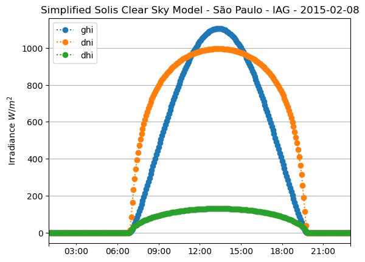 

- Tóquio: latitude=35.69; Total: 31°
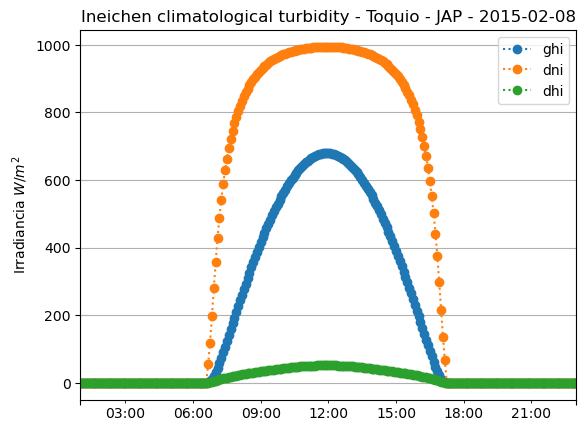 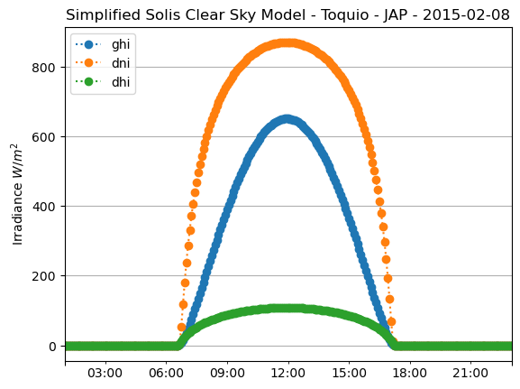 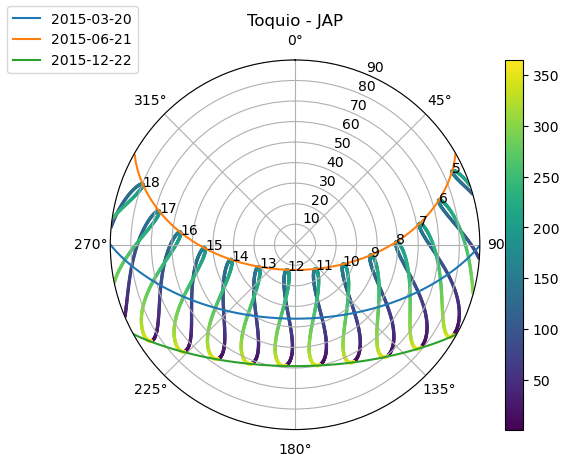

- São Tomé e Príncipe: latitude=0; Total: 6°
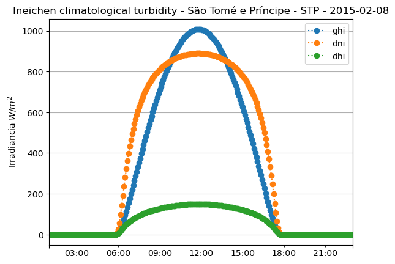  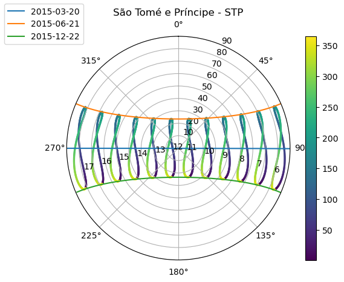

- Alemanha: latitude=52.652; Inverno: 67,5° e Verão: 30°
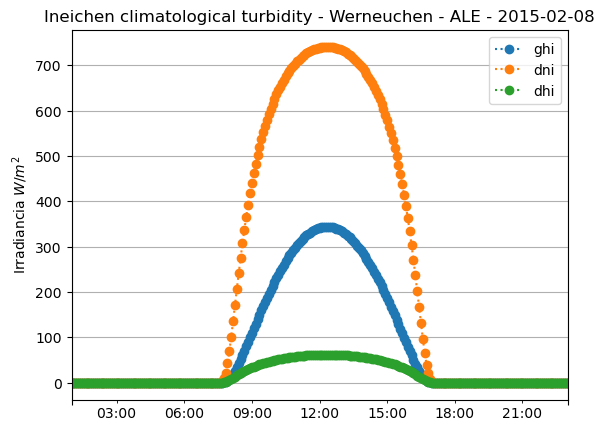 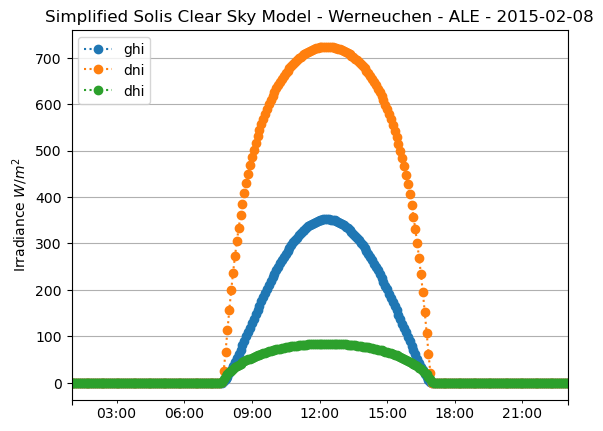 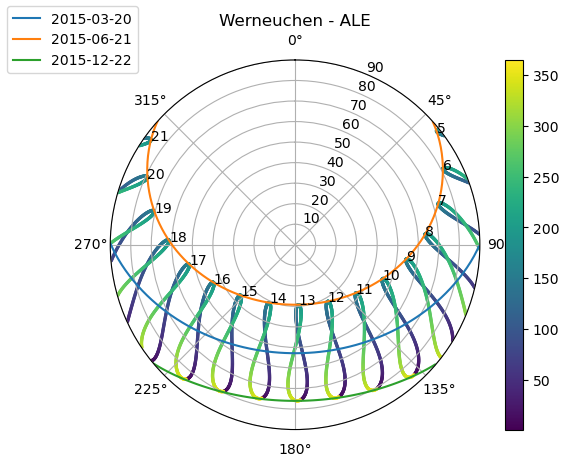

- Alasca: latitude=61.585; 
 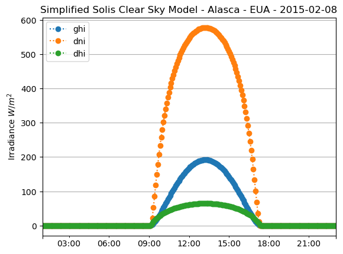 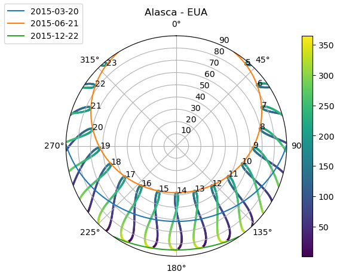

- Austrália: latitude=-34.647; Total: 15,5°
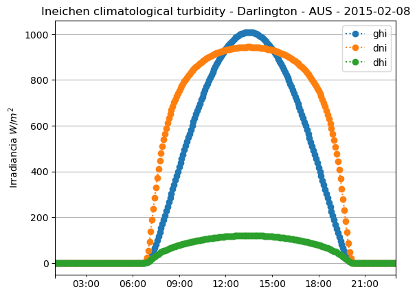  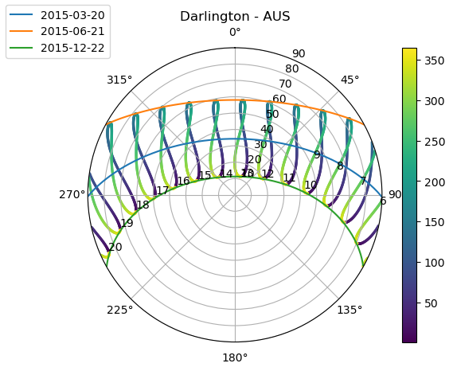

- Petrolina: latitude=-9.069; 
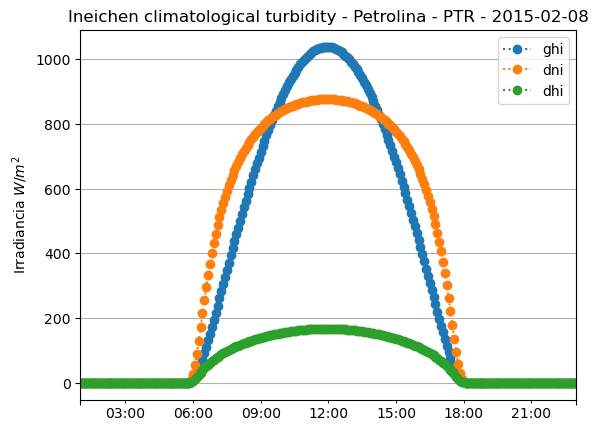 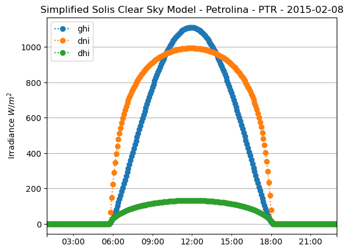 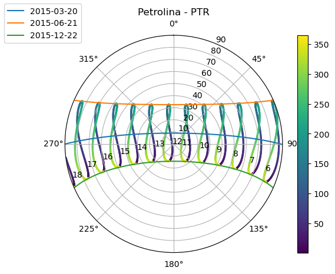

- Rajastão: latitude=27.518; Total: 10°
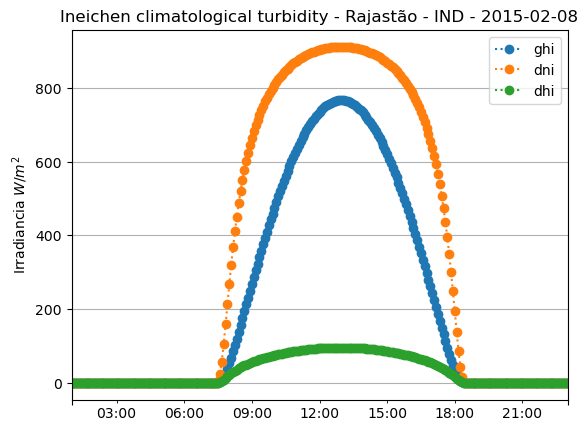 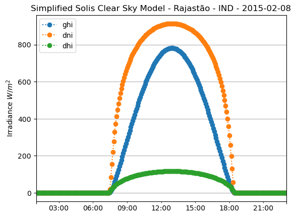 